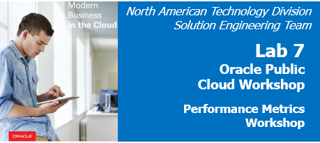
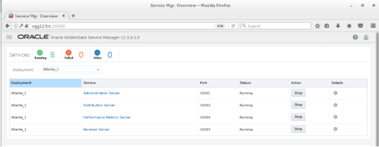
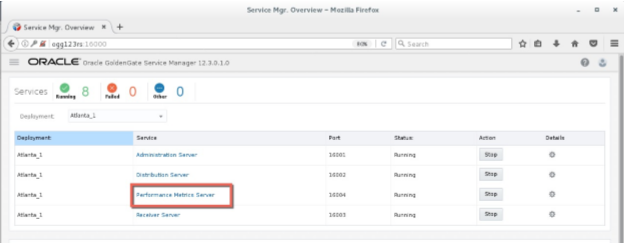
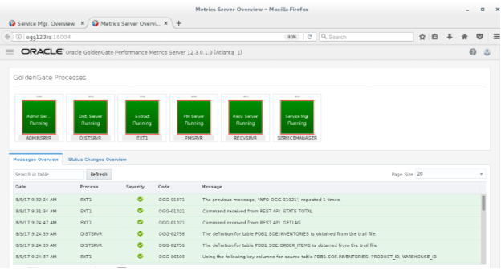
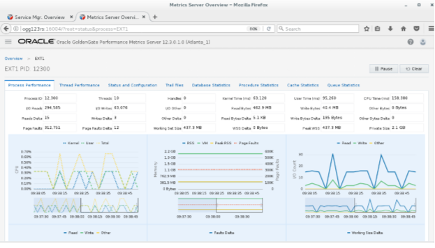

## Introduction

# Lab 7: Review	Performance	Metrics	Server	

Note:	Although you can enable	Performance	Metric Server during a deployment, the interface and associated	RESTful	APIs are covered under the	Oracle GoldenGate Management Pack License.	

# Overview 

Time to Complete 
- Perform all tasks – 20 Minutes 
- Prerequisites 
Before you begin this tutorial, you should 
•	Have a general understanding of RDBMS and data integration concepts. 
•	Have a general understanding of ETL and data synchronization concepts. 

Lab Environment 
For this lab, the Data Integration Platform Cloud and the client environment are contained within on environment for simplicity.  Most user interactions with Data Integration Platform Cloud will be through a browser installed on your local machine (Chrome preferred, Firefox is also supported).   

# Task 0: Performance Metric Server 

## Logging Into Oracle Cloud Performance Metric Server Instance

1. In your web browser, Open the ServiceManager Page

-  Enter your user name and password, then click Sign In.

If the screensaver is on just press “enter” to open the login screen. 
 
2. Select the Performance Metric Server link from the deployment area. This will open the Performance Metric Server page. 

3. Notice that all processes with the deployment are listed at the top.  These are clickable boxes that will take you into the process detailss

4. Drill in on the Extract process. This will provide you with real-time information about what the process is doing.   

Note: This information is not retained in a repository, so this is only real-time.  Historical information can be gained from other Oracle products like Oracle Enterprise Manager. 

# Summary
In this lab, we have seen how MicroServices running in DIPC can work hand to implement an end-to-end Performance Metric Review.   